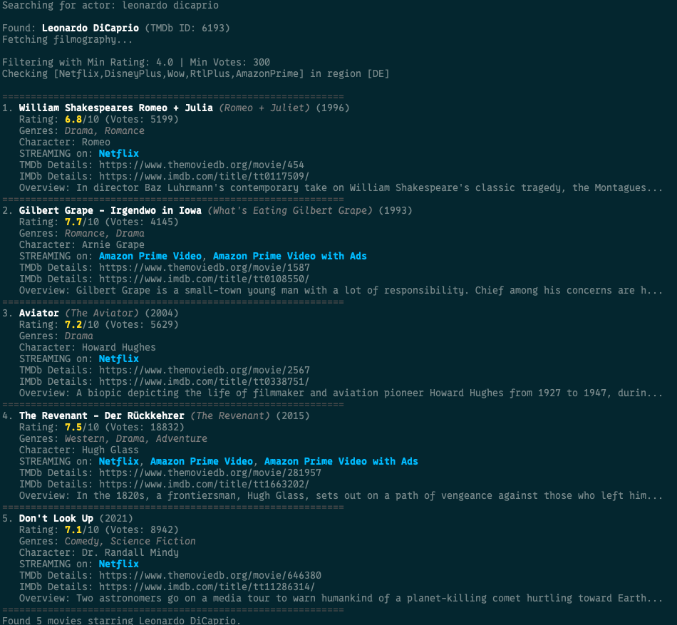

# tmdb - The movie db CLI tool

CLI tool to discover hidden gems in your streaming libraries. Fetches data from TMDB and your streaming services to 
help you find movies and shows you might have missed. 

## Example

```bash
tmdb actor "Leonardo DiCaprio"
```


## Build and Install

```bash
go build -o tmdb cmd/main.go # or make build

./tmdb
```

## Setup

1. Get an API key from TMDB: https://www.themoviedb.org/settings/api
2. Copy `.env.example` to `.env`
3. Add your TMDB API key and adjust your preferences:

    ```
    # .env file
    TMDB_API_KEY=your_api_key_here
    PROVIDERS=Netflix,DisneyPlus,Wow,RtlPlus
    REGION=DE
    MIN_RATING=7.5
    MIN_VOTES=1000
    API_TIMEOUT_SECONDS=20
    ```

## Usage

```bash
# Show top rated movies filtered by your .env settings or cli options
./tmdb top --min-rating 6.0

# Show filmographies of a specific actor
./tmdb actor "Nicolas Cage"

# List popular actors
./tmdb actor --list

# Search for actors with partial name match and show all options
./tmdb actor "tom" --list

# Search for movies with "star" in the title like Star Wars, Star Trek, etc.
./tmdb search star

# Show top rated shows
./tmdb shows --min-rating 8.0
```

## Actor Command Features

The actor command has several modes:

1. **Filmography Search**: `tmdb actor "Actor Name"`
   - Shows movies/shows for the specified actor
   - Filters by rating, votes, and streaming availability
   - Displays character names for each role

2. **List on Multiple Matches**: When searching for an actor with partial name
   - If multiple actors match, shows a list by popularity
   - Run with `--list` flag to always show the list
   - Example: `tmdb actor "tom" --list`

3. **Popular Actors**: `tmdb actor --list`
   - Shows popular actors when no name is provided
   - Sorted by popularity score

4. **Available Flags**:
   - `--list`: Show list of actors instead of filmography
   - `--genre`: Filter by genre (name or ID)
   - `--region`: Set the watch region (default from .env)
   - `--providers`: Filter streaming providers
   - `--min-rating`: Minimum rating threshold
   - `--min-votes`: Minimum votes threshold
   - `--timeout`: API timeout in seconds

## Missing Features

- [x] add movie search by title
- [x] add more filters like genre, release year, etc.
- [ ] caching of API responses to reduce load times and API calls
- [ ] fomo command. List movies leaving streaming services soon.
- [x] add tests
- [ ] generate .env file with setup command (interactive shell)
- [ ] command with some recommendations of actors
- [x] search actors and list possible matches for misspellings or non-exact names, list by popularity, if no name provided

